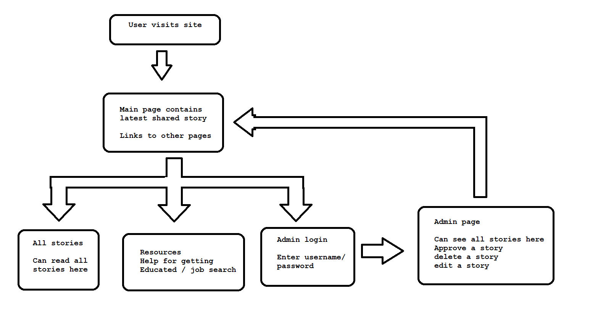
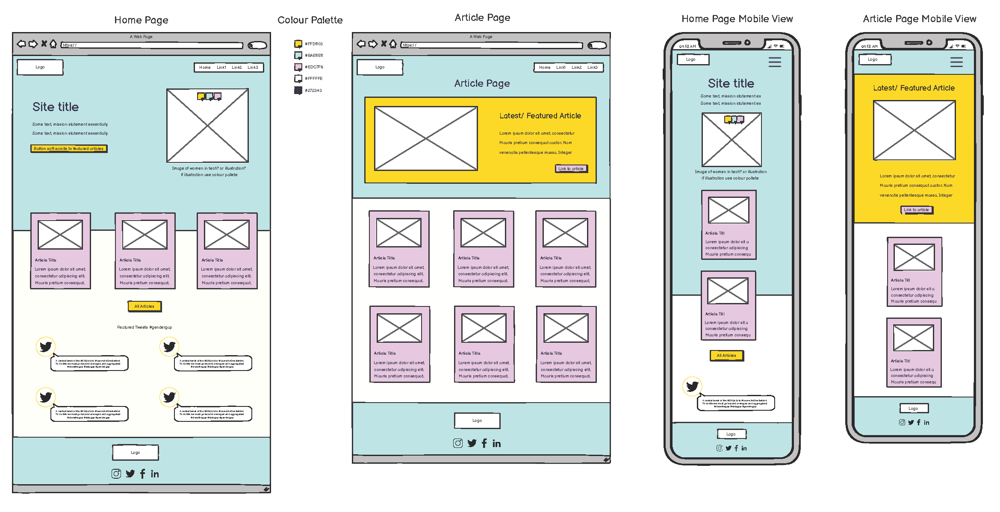

# PandoraTech

Developers: Andrew, Arron, Dee, Jamie, Martin

[Deployed Site]()  
(Note: Ctrl + click to open in a new tab)    

## Table of Content
1. [Project Goals](#project-goals)
   1. [User Goals](#user-goals)
   2. [Site owner Goals](#site-owner-goals)
2. [User Experience](#User-Experience)
   1. [Target Audience](#target-audience)
   2. [User Requirements and Expectations](#user-requirments-and-expectations)
   3. [Manual](#manual)
   4. [User Stories](#user-stories)
3. [Technical Design](#technical-design)
   1. [Flowcharts](#flowcharts)
   2. [Wireframes](#wireframes)
4. [Technologies Used](#technologies-used)
   1. [Languages](#Languages)
   2. [Frameworks and Tools](#frameworks-and-tools)
5. [Features](#features)
6. [Testing](#validation)
7. [PEP8 Validation](#pep8-validation)
8. [Bugs](#bugs)
9. [Deployment](#deployment)
10. [Credits](#credits)
11. [Acknowledgements](#ackowledgements)

## Project Goals

### User Goals
- 
- 
- 
- 

### Site Owner Goals
- 
- 
- 
- 

[Back to Top](<#table-of-content>)
## User Experience

### Target Audience
- The target audience for is women interested in a career in the tech industry.

### User Requirments and Expectations
- 
- 
- 
- 
- 

[Back to Top](<#table-of-content>)  
## User Stories

### User
1. As a User I can navigate across the site so that I can move to each feature of the site easily
2. As a User I can view articles so that I can learn more about a career in tech
3. As a User I can access links to courses so that I can see what options I have for a career in tech
4. As a User I can view a list of resources so that I can learn more toward a career in tech
5. As a User I can access links to courses so that I can see what options I have for a career in tech
6. As a User I can view all the blog posts so that I can see what I may be interested in reading
7. As a User I can use a navbar, footer, and social icons so that I can navigate the site, access menus, and access socials
 
### Admin/Authorised User
8. As an Admin/Authorised User I can access the backend so that I can create, read, update and delete database items
9. As an Admin/Authorised User I can create career path in the database so that I can add more paths as new ones appear
10. As an Admin/Authorised User I can edit existing career paths so that I can keep information up to date
11. As an Admin/Authorised User I can delete career path so that I can keep the career section up to date
12. As an Admin/Authorised User I can create a blog post so that I can add additional information and articles
13. As an Admin/Authorised User I can edit the blog post so that I can fix any typos or update information
14. As an Admin/Authorised User I can delete a blog post so that I can clean up old posts to keep information current
15. As an Admin/User I can approve pending blog posts so that I can make sure all content posted is safe

### Site Owner
16. As a Site Owner I can validate data entered into my site so that all submitted data is correct to avoid errors
17. As a Site Owner I can provide a contact us page so that users can get in touch with my business
18. As a Site Owner I can provide a fully responsive site for my customers so that they have a good user experience
 
[Back to Top](<#table-of-content>)
## Technical Design

### Flow Charts

Flow

  

### Wireframes

Home & Article Page

   
## Technologies Used

### Languages
- [Python](https://www.python.org/)
- [Javascript](https://www.javascript.com/)
- [HTML](https://www.w3.org/)
- [CSS](https://www.w3.org/)

### Frameworks and Tools
- [Balsamiq](https://balsamiq.com/)

- [GitPod](https://gitpod.io/)

- [GitHub](https://github.com/)

[Back to Top](<#Table-of-Content>)

### Libraries

#### Python Libraries
- [OS](https://docs.python.org/3/library/os.html)
- [Date time](https://docs.python.org/3/library/datetime.html)
- [Unittest](https://docs.python.org/3/library/unittest.html)

#### Third Party Libraries
- 
- 

## Features

### Blog
- A fun and challengibng quiz for all fans of The Simpsons.
- Contains a variety of questions related to The Simpsons.
- User stories covered:

Quiz image

  

### Info Section
- 
- 
- User stories covered:

Image

  

### Careers Section
- 
- User stories covered:

Image

  

### Courses Section
- 
- User stories covered:

Image

  
 
### Logo
-
- User stories covered:

Image

  

[Back to Top](<#table-of-content>)
## Validation

### PEP8 Validation

page

Page

Page

  

## Testing

### Manual Testing

View manual testing

### Testing User Stories

 User:
1. As a User, I would like to...

| **Feature** | **Action** | **Expected Result** | **Actual Result** |
|-------------|------------|---------------------|-------------------|
|  |   |  |  |
|  |  |  |  |

Images

Site Owner
8. As the site owner, I would like...

| **Feature** | **Action** | **Expected Result** | **Actual Result** |
|-------------|------------|---------------------|-------------------|
|  |  |  |  |

Images

### Automated Testing
 
 

View automated testing

- Automated testing was done using the unittest and coverage librararies for Python.

### Unit Tests
- Test...

- Test ran and passed with the correct email format submitted for the test.

### Coverage 

- Coverage was installed via the terminal, pip install coverage

- Coverage was then used to test using the following...

- The results of the test were the following:

- A HTML report was also generated using the command, coverage html

[Back to Top](<#table-of-content>)
## Bugs

| **Bug** | **Fix** |
| ----------- | ----------- |
| Bug I had | I fixed it by...|
| Bug I had | I fixed it by... |

[Back to Top](<#table-of-content>)
## Deployment
### Heroku / Firebase

[Official Page](https://devcenter.heroku.com/articles/git) (Ctrl + click)
1. Log in to your account at heroku.com.
2. Create a new app, add a unique app name and choose your region.
3. Click on create app.
4. Go to "Settings".
5. Under Config Vars store any sensitive data in .json file. Name 'Key' field, copy the .json file paste it to 'Value' field. Also add a key 'PORT' and value '8000'.
6. Add required buildpacks. For this project, I set up 'Python' and 'node.js' in that order.
7. Go to "Deploy" and select "GitHub" in "Deployment method"
8. To link up the Heroku app to our Github repository code enter your repository name, click 'Search' and then 'Connect' when it shows below.
9.  Choose the branch you want to buid your app from.
10. If prefered, click on "Enable Automatic Deploys", which keeps the app up to date with your GitHub repository
11. Wait for the app to build. Once ready you will see the “App was successfully deployed” message and a 'View' button to take you to your deployed link.

### Fork Repository
To fork the repository by following these steps:
1. Go to the GitHub repository
2. Click on Fork button in upper right hand corner

### Clone Repository
You can clone the repository by following these steps:
1. Go to the GitHub repository 
2. Locate the Code button above the list of files and click it 
3. Select if you prefere to clone using HTTPS, SSH, or Github CLI and click the copy button to copy the URL to your clipboard
4. Open Git Bash
5. Change the current working directory to the one where you want the cloned directory
6. Type git clone and paste the URL from the clipboard ($ git clone https://github.com/YOUR-USERNAME/YOUR-REPOSITORY)
7.Press Enter to create your local clone.

[Back to Top](<#table-of-content>)
## Credits

### Media
- [Flaticon](https://www.flaticon.com/free-icon/physics_4270905?term=nuclear&page=1&position=16&page=1&position=16&related_id=4270905&origin=search): Nuclear icons created by Freepik - Flaticon</a>
- [Background image](https://www.freepik.com/vectors/fluffy-clouds) 
created by pch.vector - www.freepik.com</a>

### Code
- [Site](https://www.google.com)

## Acknowledgements

### Special thanks to the following:
- Deloitte
- Trust in Soda
- Code Institute

[Back to Top](<#table-of-content>)